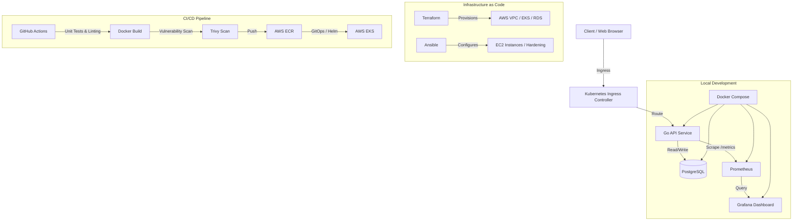

# YOLO Cloud-Native DevOps Platform & Task App

A comprehensive, production-grade cloud-native DevOps repository representing state-of-the-art Infrastructure as Code (IaC), containerization, orchestration, continuous integration, continuous delivery (GitOps), and observability.

The system deploys a modular **Go REST API backend** connected to a **PostgreSQL database**, along with a **high-aesthetic Web Dashboard** providing task management and simulated/live telemetry portal functionality.

---

## Repository Architecture



---

## Directory Structure

```text
YOLO-app/
├── .github/
│   ├── dependabot.yml       # Automated weekly dependency & vulnerability updates
│   └── workflows/
│       ├── ci.yml           # Modernized CI (lint, test, Helm, Docker, Trivy)
│       ├── codeql.yml       # CodeQL Static Application Security Testing (SAST)
│       └── release.yml      # Semantic container publishing to GHCR on tags
├── app/
│   ├── backend/             # Golang REST API Service
│   │   ├── frontend/        # Embedded static dashboard assets
│   │   ├── migrations/      # SQL database schemas (up/down migrations)
│   │   ├── Dockerfile       # Secure multi-stage Docker build with HEALTHCHECK & OCI labels
│   │   ├── main.go          # Graceful shutdown, decoupled probes, connection pooling, correlation IDs
│   │   ├── main_test.go     # Expanded test suite covering probes, validation, and middleware
│   │   └── go.mod / go.sum  # Go dependency management
│   └── frontend/            # High-aesthetic HTML/CSS/JS frontend client
├── terraform/               # Infrastructure as Code
│   ├── backend.tf           # S3 remote state backend + DynamoDB distributed state locking
│   ├── main.tf              # AWS provider setup and module composition
│   ├── variables.tf         # Root input variable declarations
│   ├── outputs.tf           # Root infrastructure outputs
│   ├── environments/        # Multi-environment variable definitions (dev.tfvars, prod.tfvars)
│   └── modules/             # Modular Terraform designs
│       ├── vpc/             # Multi-AZ VPC networking, NAT gateways, route tables
│       ├── eks/             # EKS managed Kubernetes cluster + node groups
│       └── rds/             # KMS-encrypted PostgreSQL RDS instance with restricted SGs
├── ansible/                 # Server configuration management & host hardening
│   ├── ansible.cfg          # Default ansible overrides
│   ├── group_vars/all.yml   # Centralized variable definitions
│   ├── inventory/hosts.ini  # Host inventory configurations
│   ├── playbooks/site.yml   # Main server provisioning playbook
│   └── roles/
│       ├── docker/          # Docker Engine installation & group setup
│       ├── hardening/       # SSH hardening, UFW firewall, unattended security updates, sysctl
│       └── monitoring_agent/# Prometheus node_exporter systemd service deployment
├── deploy/                  # Orchestration & GitOps
│   ├── k8s/                 # Raw Kubernetes manifests (Deployment, PDB, ServiceAccount, HPA, NetworkPolicy)
│   ├── helm/yolo-app        # Complete Helm chart with Ingress, HPA, PDB, and ServiceAccount
│   │   ├── values-dev.yaml  # Development override values
│   │   └── values-prod.yaml # Production override values
│   └── gitops/              # ArgoCD GitOps application definitions
├── monitoring/              # Observability stack config
│   ├── alertmanager.yml     # Alertmanager routing, grouping, and notification channels
│   ├── prometheus.yml       # Scrape targets and scrape interval configs
│   ├── alert.rules.yml      # SRE alerts (PodCrashLoop, Memory Saturation, DB Connection Pool, Latency)
│   └── grafana/             # Auto-provisioned dashboards and Prometheus datasources
├── docs/runbooks/           # SRE Operational Incident Runbooks
│   ├── high-error-rate.md   # Triage & recovery for HighHttpErrorRate alerts
│   └── pod-crashloop.md     # Triage & recovery for KubePodCrashLooping alerts
├── Makefile                 # Standardized CLI commands for dev, test, build, scan, and deploy
├── .env.example             # Documented environment variables with development defaults
└── docker-compose.yml       # Local dev environment orchestration
```

---

## Quickstart Guide

### 1. Developer CLI with Makefile
Standardized commands for local development, testing, and operations:

```bash
make help          # View all available targets and descriptions
make test          # Run test suite with race detector and coverage report
make docker-build  # Compile hardened container image
make docker-up     # Boot the entire stack locally via Docker Compose
make docker-down   # Teardown local containers and clean volumes
make helm-lint     # Validate Helm chart syntax and parameters
make security-scan # Run local Trivy vulnerability scanner
```

### 2. Local Development (Docker Compose)
Run the entire environment locally, which boots PostgreSQL, compiles the Go API with embedded UI, configures Prometheus to scrape metrics, and provisions Grafana.

```bash
# Build and start services in detached mode
docker compose up -d --build

# Verify running containers
docker compose ps
```
- **Web App UI & API**: [http://localhost:8080](http://localhost:8080)
- **Liveness Probe**: [http://localhost:8080/livez](http://localhost:8080/livez)
- **Readiness Probe**: [http://localhost:8080/readyz](http://localhost:8080/readyz)
- **Prometheus Metrics**: [http://localhost:8080/metrics](http://localhost:8080/metrics)
- **Prometheus UI**: [http://localhost:9090](http://localhost:9090)
- **Grafana UI**: [http://localhost:3000](http://localhost:3000) (Credentials: `admin`/`admin`)

---

## DevOps & SRE Engineering Features

### 🛡️ Container Security & Zero-Downtime Reliability
- **Multi-Stage Build**: Minimal footprint using `alpine:3.18.2` and non-root execution (`appuser:1000`).
- **Graceful Shutdown**: Intercepts `SIGINT` / `SIGTERM` and drains in-flight HTTP connections over a 15s timeout.
- **Decoupled Probes**: `/livez` for process survival, `/readyz` for database connectivity and pool health.
- **PreStop Hook & PDB**: `sleep 5` lifecycle preStop hook allows ingress controller endpoint draining before termination; `PodDisruptionBudget` guarantees at least 2 replicas during node evictions.
- **Dedicated ServiceAccount**: Hardened with `automountServiceAccountToken: false` to mitigate credential theft.

### 📐 Infrastructure as Code (Terraform & Ansible)
- **Remote State with Locking**: Configured AWS S3 backend with DynamoDB locking (`terraform/backend.tf`).
- **Encrypted Storage**: RDS instance encrypted with AWS KMS (`storage_encrypted = true`).
- **Network Isolation**: RDS security group strictly restricted to EKS worker node security groups.
- **Host Hardening**: Automated security patches (`unattended-upgrades`), kernel sysctl hardening, and `node_exporter` telemetry agent.

### 📈 Observability & SRE Incident Management
- **Structured JSON Logging**: Every HTTP request emits structured JSON with `level`, `duration_ms`, `status`, and `X-Request-ID`.
- **Alertmanager Routing**: Configured alert routes for critical (PagerDuty/webhook) and warning (Slack) notifications.
- **SRE Alert Rules**: Pre-configured alerts for 5xx spikes, P95 latency > 500ms, PodCrashLooping, memory saturation (>85%), and DB connection pool saturation.
- **Operational Runbooks**: Standard incident response procedures documented in `docs/runbooks/`.

### 🚀 CI/CD Security Automation
- **GitHub Actions v4/v5**: Pinned modern actions for checkout, Go, buildx, and Trivy.
- **CodeQL SAST**: Automated static application security testing scanning for CWE vulnerabilities.
- **Dependabot**: Automated weekly updates for Go modules, Docker base images, Actions, and Terraform.
- **Release Publishing**: Tag-driven semantic releases (`v*.*.*`) publishing signed container images to GitHub Container Registry (GHCR).
