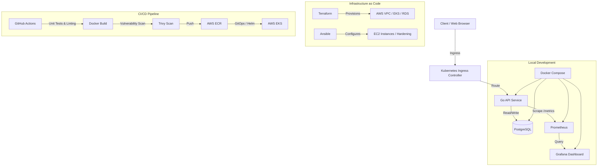

# YOLO Cloud-Native DevOps Platform & Task App

A comprehensive, production-grade cloud-native DevOps repository representing state-of-the-art Infrastructure as Code (IaC), containerization, orchestration, continuous integration, continuous delivery (GitOps), and observability.

The system deploys a modular **Go REST API backend** connected to a **PostgreSQL database**, along with a **high-aesthetic Web Dashboard** providing task management and simulated/live telemetry portal functionality.

---

## Repository Architecture



---

## Directory Structure

```text
YOLO-app/
├── .github/workflows/       # GitHub Actions CI pipelines
│   └── ci.yml               # Testing, linting, Docker build, and Trivy security scanning
├── app/
│   ├── backend/             # Golang REST API
│   │   ├── migrations/      # SQL database schemas (up/down migrations)
│   │   ├── Dockerfile       # Secure multi-stage Docker build config
│   │   ├── main.go          # Application server, endpoints, and telemetry middleware
│   │   ├── main_test.go     # Golang test suite
│   │   └── go.mod / go.sum  # Go dependency management
│   └── frontend/            # High-aesthetic HTML/CSS/JS frontend client
│       ├── index.html       # Sleek UI panel layout
│       ├── style.css        # Premium glassmorphism dark-mode style
│       └── app.js           # Resilient UI logic with offline fallback and metrics poller
├── terraform/               # Infrastructure as Code
│   ├── main.tf              # AWS provider setup and module composition
│   ├── variables/outputs.tf # Root variables and output bubbles
│   └── modules/             # Modular Terraform designs
│       ├── vpc/             # VPC networking (multi-AZ subnets, NAT/IGW)
│       ├── eks/             # EKS managed Kubernetes cluster + IAM Roles
│       └── rds/             # Multi-AZ RDS PostgreSQL database instance
├── ansible/                 # Server configuration management
│   ├── ansible.cfg          # Default ansible overrides
│   ├── inventory/hosts.ini  # Host configurations
│   ├── playbooks/site.yml   # Main configuration execution playbook
│   └── roles/               # Reusable configuration roles
│       ├── docker/          # Docker Engine repository setup & installation
│       └── hardening/       # OS Hardening (SSH securing, firewalls, user limits)
├── deploy/                  # Orchestration configurations
│   ├── k8s/                 # Raw Kubernetes manifests (Deployment, HPA, NetworkPolicy)
│   ├── helm/yolo-app        # Structured Helm chart packaging
│   └── gitops/              # ArgoCD GitOps application resources
├── monitoring/              # Observability stack config
│   ├── prometheus.yml       # Scrape targets and rule loading configs
│   ├── alert.rules.yml      # Alert definitions for latencies/errors
│   └── grafana/             # Auto-provisioned dashboards and datasources
└── docker-compose.yml       # Local dev environment orchestration
```

---

## Quickstart Guide

### 1. Local Development (Docker Compose)
Run the entire environment locally, which boots PostgreSQL, compiles the Go API, configures Prometheus to scrape it, and sets up a Grafana dashboard.

```bash
# Build and start services in detached mode
docker compose up -d --build

# Verify running containers
docker compose ps
```
- **Web App UI**: [http://localhost:8080](http://localhost:8080) (Backend API matches `/api/*`)
- **Prometheus UI**: [http://localhost:9090](http://localhost:9090)
- **Grafana UI**: [http://localhost:3000](http://localhost:3000) (Credentials: `admin`/`admin`)

### 2. Run Go Tests
Validate HTTP handlers and path normalization middleware:
```bash
cd app/backend
go test -v -race ./...
```

---

## DevOps Implementation Details

### 🛡️ Container Security Hardening
Our backend `Dockerfile` implements several security standards:
- **Multi-Stage Build**: Keeps the final image size minimal by omitting compiler dependencies.
- **Distroless/Alpine Minimal Base**: Uses a secure, small runtime footprint (`alpine:3.18`).
- **Non-Root User Execution**: Instead of executing as `root`, we create and use `appuser` (ID `1000`) inside the container.

### 📐 Infrastructure as Code (Terraform & Ansible)
The Terraform suite builds a secure AWS environment:
- **VPC Module**: Creates isolated private subnets across multiple AZs. EKS and RDS instances live here.
- **EKS Module**: provisions a managed Kubernetes cluster with worker nodes inside private subnets, ensuring no direct public exposure.
- **RDS Module**: Deploys PostgreSQL with a DB subnet group. The security group explicitly blocks external connections and only allows inbound PostgreSQL requests (Port 5432) from private VPC subnets.
- **Ansible Hardening**: Configures VM OS parameters, disables password authentication, restricts root SSH access, limits rate checks with `fail2ban`, and configures an active `ufw` firewall whitelist.

### ☸️ Kubernetes Orchestration & GitOps
Our Kubernetes configurations provide robust runtime management:
- **Network Policies**: Blocks all ingress traffic except traffic arriving from the Nginx Ingress Controller namespace, and restricts egress paths to local DNS and PostgreSQL port 5432.
- **HPA**: Autoscales pods from 2 to 10 replicas when CPU utilization exceeds 70%.
- **Helm Packaging**: Fully parametrized chart allowing seamless environment overrides (e.g. dev, staging, prod).
- **ArgoCD GitOps**: Provides declarative definitions that synchronize cluster states directly with modifications committed to this repository.

### 📈 Observability & Alerting
- **Prometheus Middleware**: The Go API registers request metrics (`yolo_api_http_requests_total`, `yolo_api_http_request_duration_seconds`) labeled by method, path, and response code.
- **Alerting Rules**: Configures rules to trigger notifications when the 5xx error rate exceeds 5% or the P95 latency exceeds 500ms.
- **Grafana provisioning**: Auto-imports the Prometheus database and provisions a dashboard visualizer showing live requests volumes, error rates, throughputs, and latencies.

---

## CI/CD Pipeline
Every pull request and push to the `main` branch triggers our GitHub Actions pipeline:
1. **Linting**: Analyzes Go formatting, errors, and styling.
2. **Testing**: Runs the unit test suite verifying latency recording and handlers.
3. **Helm Lint**: Validates Helm chart syntax and parameters.
4. **Docker Compile**: Builds the container image.
5. **Trivy Vulnerability Scan**: Scrapes image layers to identify vulnerabilities, halting the build if high or critical issues are detected.
